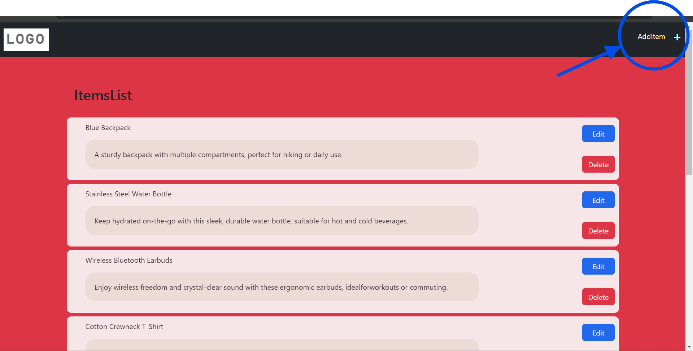
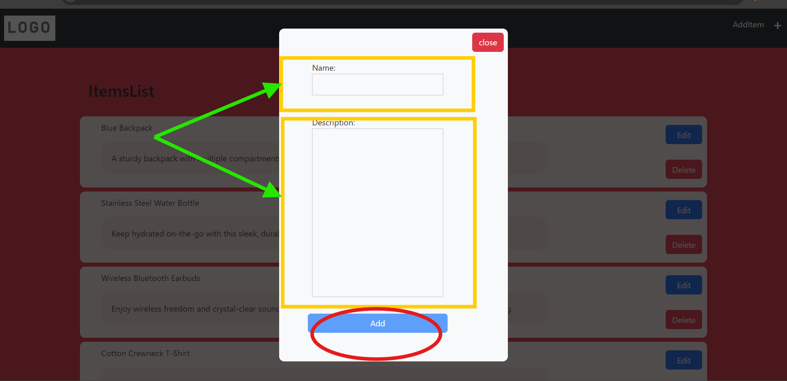
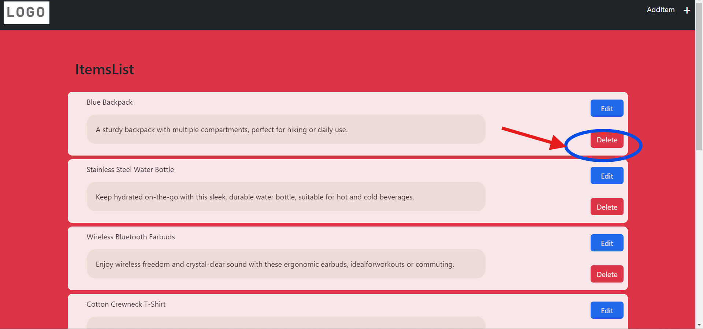
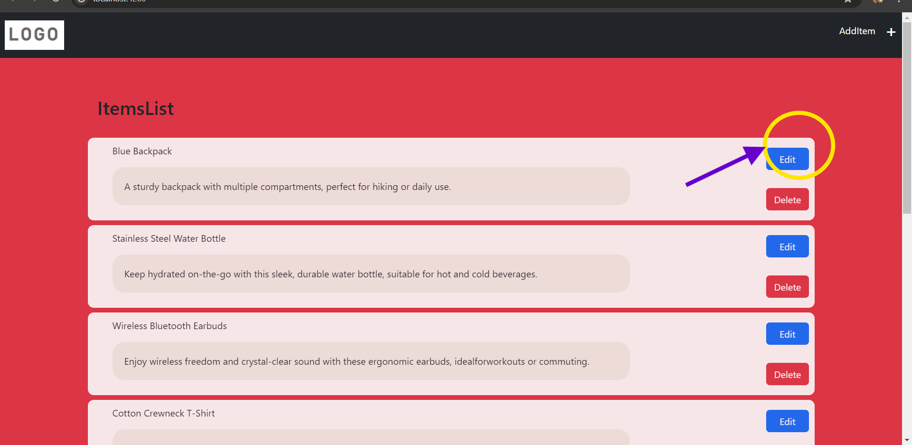
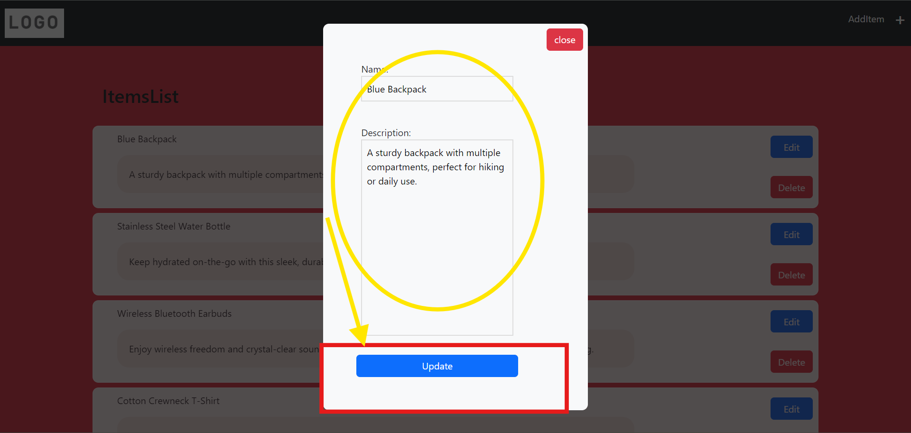

Description

The ItemList App is a versatile tool designed to simplify items management and iteam creation processes. It allows users to fetch, create , update, and delete items data. Additionally, users can seamlessly create and store items, enhancing collaboration and project management efficiency.

Key Features
(a). User Data Fetching: Fetch Items list effortlessly to streamline user Items list.

(b). Items Creation: Create and store item seamlessly for improved collaboration and project management.

(c). Items Navigation: Easily navigate to the Items to access and manage items lists.

Installation

1.Ensure Node.js and npm are installed: Angular requires Node.js and npm to be installed on your system. You can download and install them from the Nodejs website.

2.Run this Command install all paroject dependencies to get install.

```
npm install

```

3.Make sure to insatll json server.

```
npm install -g json-server
```

4.Then, you can start JSON Server and specify the JSON file you want to watch.

```
json-server --watch db.json
```

5.Start the development server:

```
ng serve -o
```

Usage

User View
• As you will redirected to the Item List View of the App and if you want to navigate to Add Items than in header section you will find the option to navigate.
which will open a pop up for adding items to db.json file.



• To delete Items you need to select the items Delete button, enable you for deleteing items for a user.


• For update a items after you have createTeam button in items section which will open a Pop up where you can define a Name and Description and update button will update items data to db.json file.



Contact
mail:manish159rai@gmail.com linkedin:www.linkedin.com/in/manish1rai
